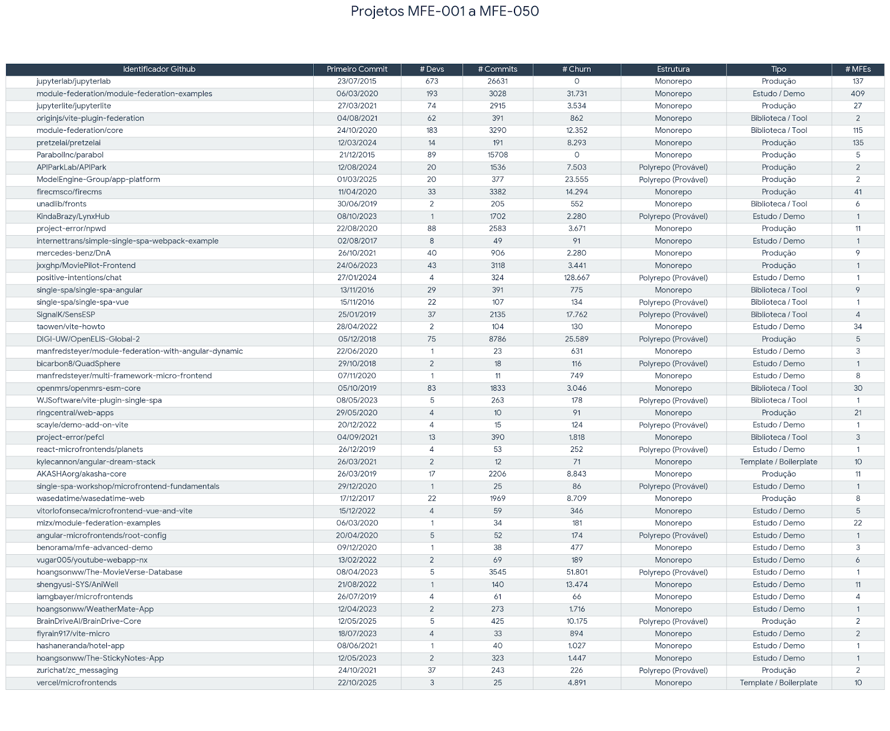

# Mapping the Microfrontend Ecosystem: A Dataset of Open Source Projects

  

This represents the artifact and dataset for the **MSc Research Project (CIn/UFPE, 2027)**. The primary objective was to map, mine, and characterize the ecosystem of **Microfrontend Architectures** in Open Source Software (OSS), providing a curated set of validated projects using technologies like Module Federation, Single-SPA, and Bit.

### Author
* **Samara Silvia Sabino** `samarasilvia.dev@gmail.com`
* **Advisor:** `Vinicius Cardoso Garcia`

## Description (Case Study: The "curated set Set")

Unlike generic repository lists, this project implements a rigorous **Multi-Stage Mining Methodology ("Plan C")**. It acts as a filter to separate simple "Hello World" demos from real, production-ready microfrontend architectures.

The project's key differentiator is its **Manual Curation & Architectural Validation**. Through a pipeline of heuristic search and metadata enrichment, we filtered over 2,800 candidates to identify projects that truly implement distributed frontend patterns (Monorepos vs. Polyrepos).

## Methodology and Implemented Pipeline

The dataset was built following a strict mining pipeline, divided into the following stages:

### Mining Infrastructure (The "Core")
- **Heuristic Search:** A targeted search strategy using GitHub API to find specific configuration files (`webpack.config.js`, `package.json`) identifying dependencies like `@module-federation/core`.
- **Metadata Enrichment:** A process to fetch deep activity metrics (Churn, Contributors, Project Age) decoupled from the initial search.
- **Architectural Classification:** Automated and manual labelling of project structures (Monorepo vs. Polyrepo) and integration types.

### Curation Criteria (The "Lens")
- **Maturity Filter:** Exclusion of projects with < 10 commits or single-contributor "toy projects".
- **Activity Filter:** Identification of "Zombie" projects (no activity in >1 year).
- **Technology Validation:** Confirmation of specific microfrontend enablers (e.g., Module Federation Plugin usage vs. simple imports).

## Prerequisites

- [Python](https://www.python.org/) (version 3.10 or higher)
- [Pip](https://pypi.org/project/pip/) (Package Manager)
- A valid **GitHub Personal Access Token** (for API rate limits)

## How to Reproduce

The project consists of sequential scripts that must be run to reproduce the dataset.

1.  **Clone the Repository and Install Dependencies**
    ```sh
    git clone [https://github.com/SamaraSilvia81/mfe-oss-dataset.git](https://github.com/SamaraSilvia81/mfe-oss-dataset.git)
    cd mfe-oss-dataset
    pip install -r requirements.txt
    ```

2.  **Run the Heuristic Miner (Phase 1)**
    This script searches for raw candidates based on file signatures.
    ```sh
    python src/01_mining_heuristics.py
    ```
    *Output: `data/raw/candidates_fase1.json`*

3.  **Run the Enrichment & Filtering (Phase 2-3)**
    This step fetches metrics (Churn, Commits) and applies the "curated set Set" filters.
    ```sh
    python src/02_enrichment_filtering.py
    ```
    *Output: `data/processed/dataset_final_curated.csv`*

## 🏦 Dataset Overview (Top Projects)

The following table presents the curated **"curated set Set" (Top 50)**, sorted by identifier (MFE-001 to MFE-050). These projects represent the most relevant architectural examples found.



### Key Metrics Explained
| Metric | Description | Relevance for Research |
| :--- | :--- | :--- |
| **# Churn** | Lines of code added/deleted. | Indicates maintenance effort and architectural volatility. |
| **# MFEs** | Number of modules/remotes. | Shows the granularity of the distributed system. |
| **Structure** | Monorepo vs. Polyrepo. | Defines the governance model of the microfrontend. |

## Automated Analysis (Results)

To generate the statistical plots (Distributions, Time Series) presented in the article:

```sh
python src/03_generate_plots.py